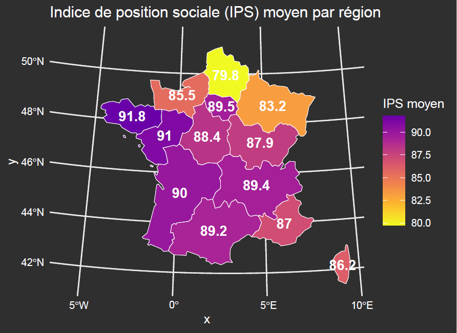
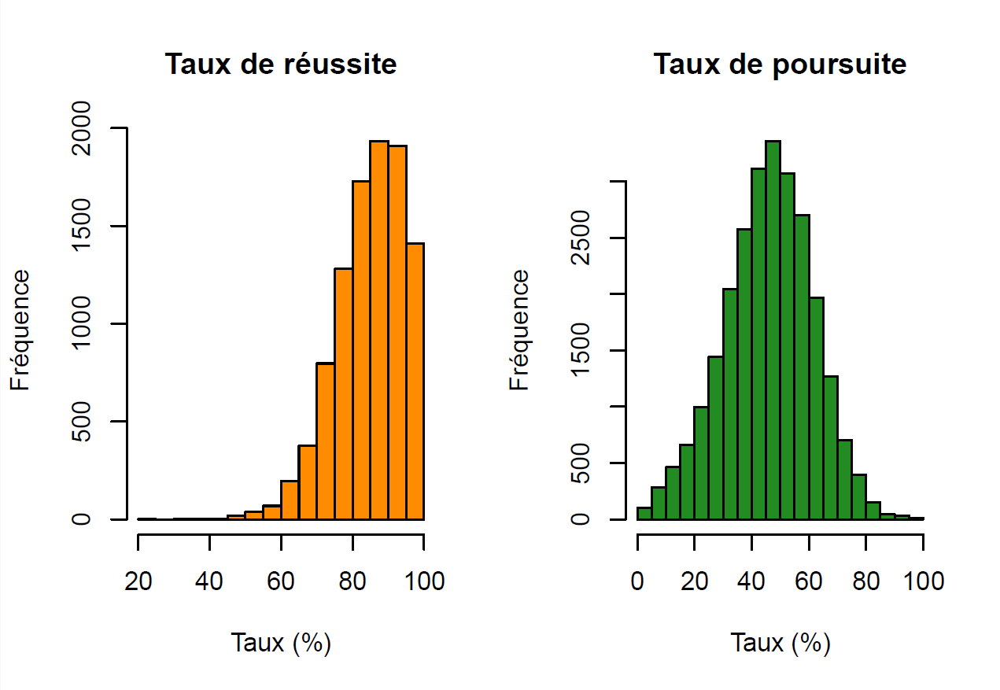
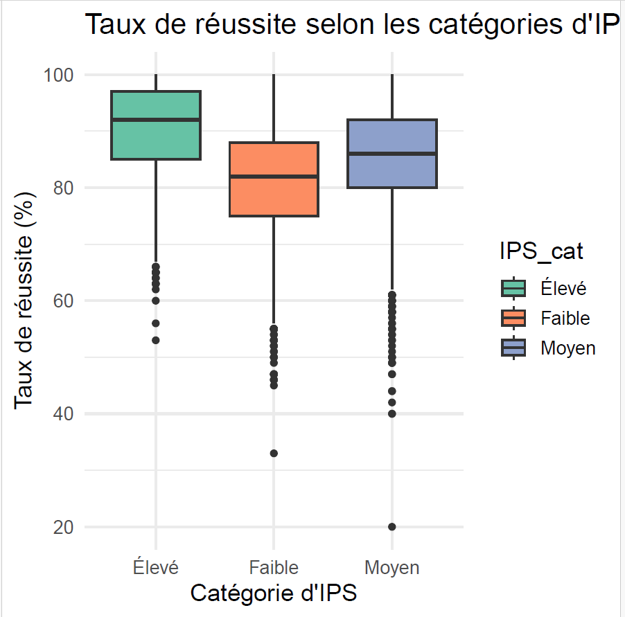

# 📈 Deciphering Educational Inequality: A Data-Driven Study of French Vocational High Schools

**UE Base de données & Sciences des données** | L2 MIASHS  
**Team:** Les Regressions Linéaires (The Linear Regressions)
---

## 📝 Executive Summary
This project investigates the relationship between socio-economic status, quantified by the Social Position Index (IPS), and student trajectories within the French vocational education system. By leveraging massive datasets from the 2018-2022 period, we aim to answer a central question:

**To what extent does a school's social environment predict academic success and professional integration?**

---

## 🔍 Visual Analytics & Key Findings

### 1. Spatial Inequality Patterns
We mapped the average IPS across French regions to identify geographic disparities. The analysis reveals a heterogeneous landscape where socio-economic "hubs" significantly impact the resources available to vocational students.

### 2. Distribution & Central Tendencies
Before modeling, we performed a deep dive into the distributions of success rates and student orientations.

### 3. Categorical Impact (Boxplot Analysis)
By segmenting establishments into **Low, Medium, and High IPS** categories, the data shows a stark reality: schools in higher socio-economic brackets maintain significantly higher median success rates.

### 4. Predictive Modeling: The Success Equation
We applied a linear regression model to evaluate the correlation between social origin and academic performance:

$$Success = 0.423 \times IPS + 49.08$$

* **Key Stat:** With an $R^2 = 0.169$, the model confirms that while IPS is a significant predictor, academic success remains a multi-factorial phenomenon.

---

## 📂 Repository Architecture

| Path | Contents |
| :--- | :--- |
| `data/` | Cleaned CSV datasets (IPS, Success rates, Professional integration) |
| `images/` | SQL query outputs, GIS maps, and statistical plots |
| `rapport.Rmd` | The comprehensive source code (R + Markdown + LaTeX) |
| **`Rapport_final.pdf`** | **The final academic report (Formatted for printing)** |
| `README.md` | Project documentation and overview |

---

## 🛠️ Technology Stack

* **Data Engineering:** MySQL / PhpMyAdmin (Complex joins, data cleaning).
* **Statistical Analysis:** R Language (`dplyr`, `stats` modeling).
* **Data Visualization:** `ggplot2` and `sf` (Geographic mapping).
* **Documentation:** RMarkdown & LaTeX (TinyTeX).

---

## 👥 Authors

Arthur Feschet, Haitham Alfakhry, Noah Chayrigues, Felicie Sadet  
*Data Science Students*

---

## 🙏 Acknowledgments
Special thanks to our instructors, **Mme Sandra Bringay** and **Mme Marine Demangeot**, for their guidance throughout this L2 MIASHS curriculum.
